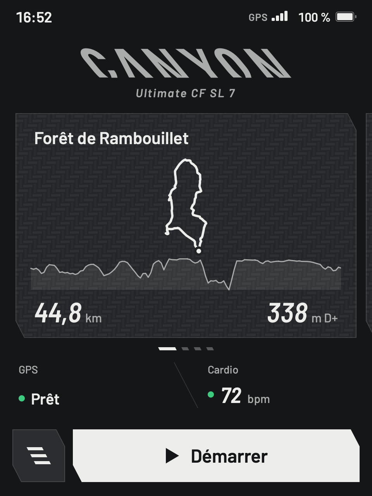
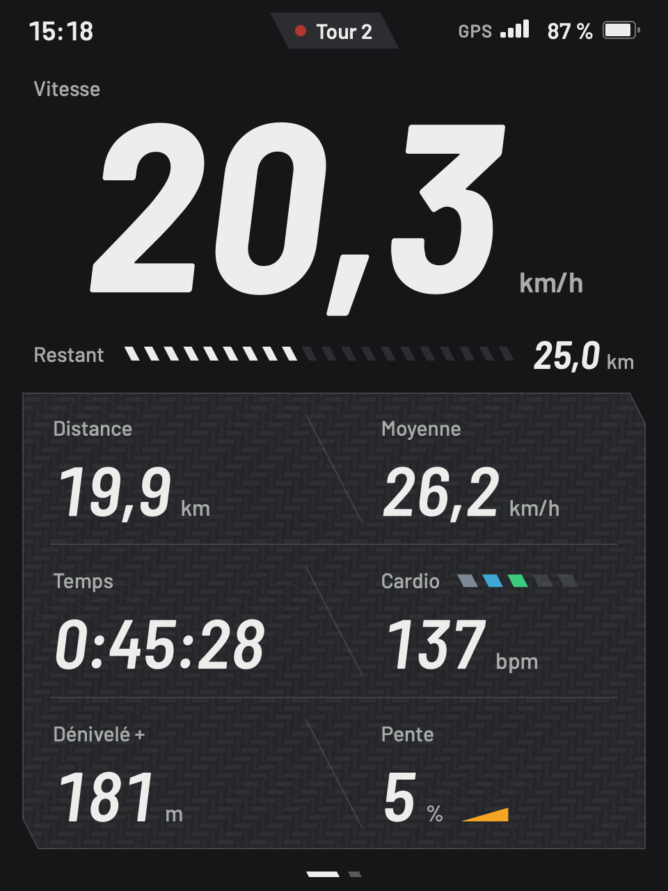
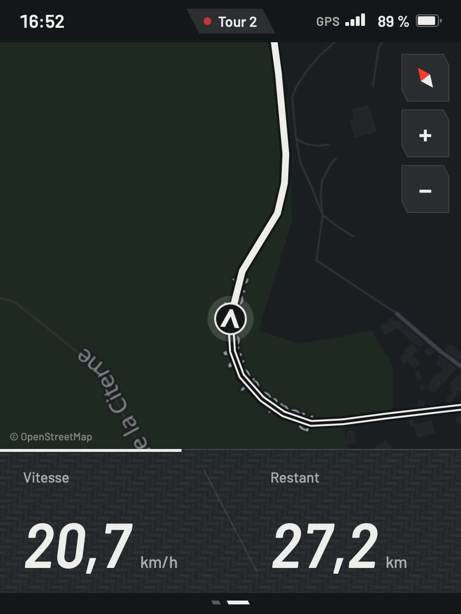
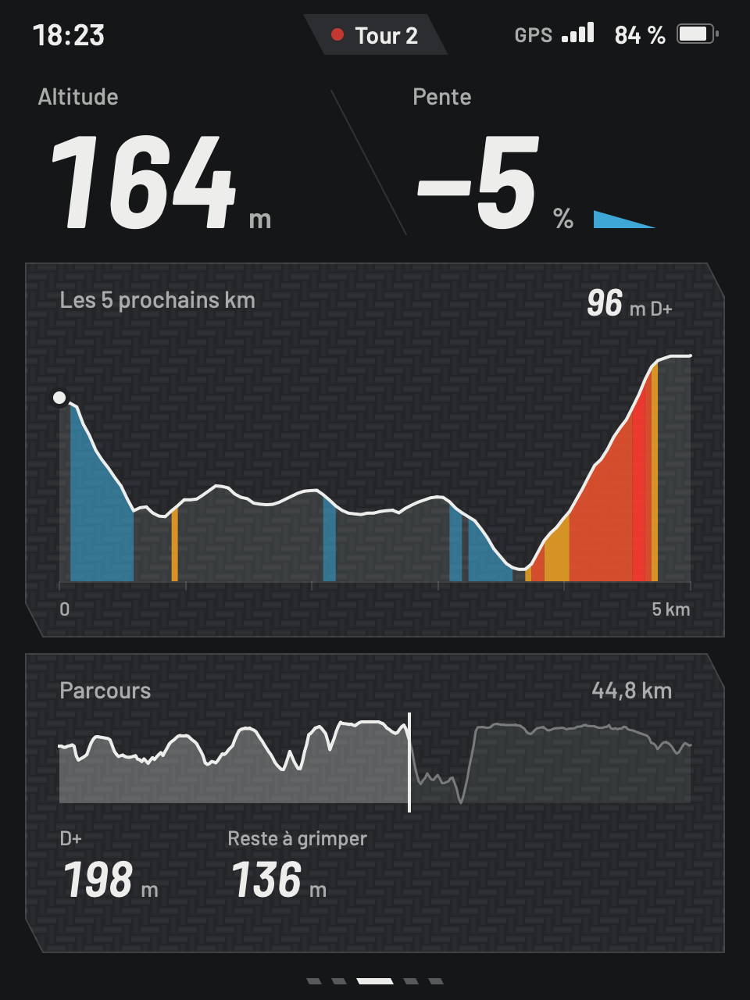
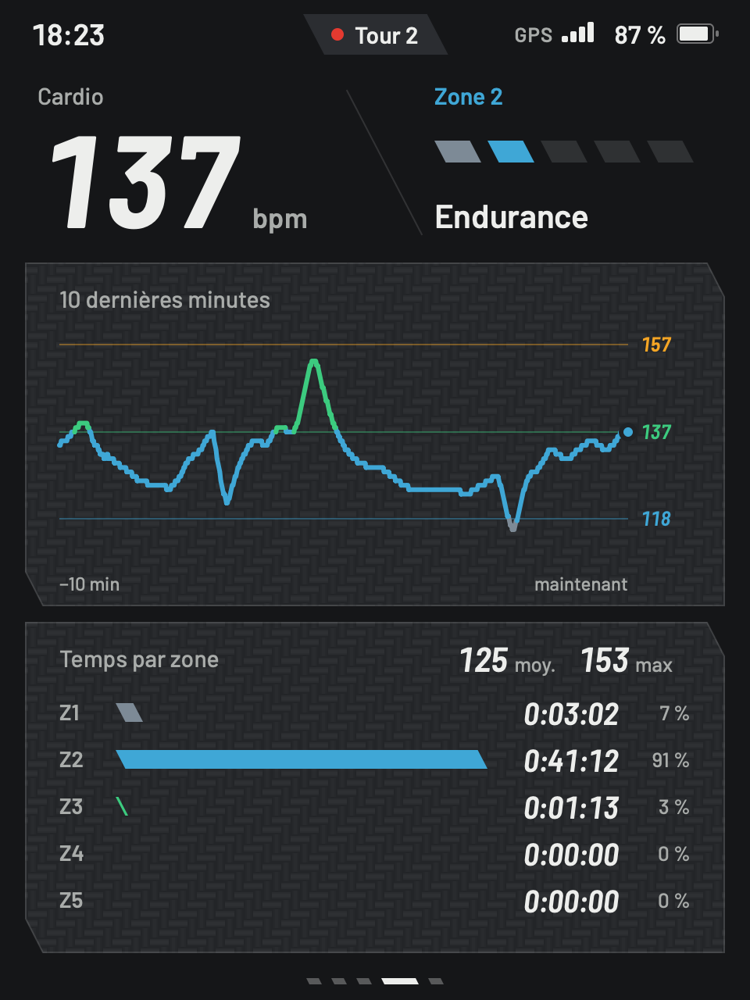
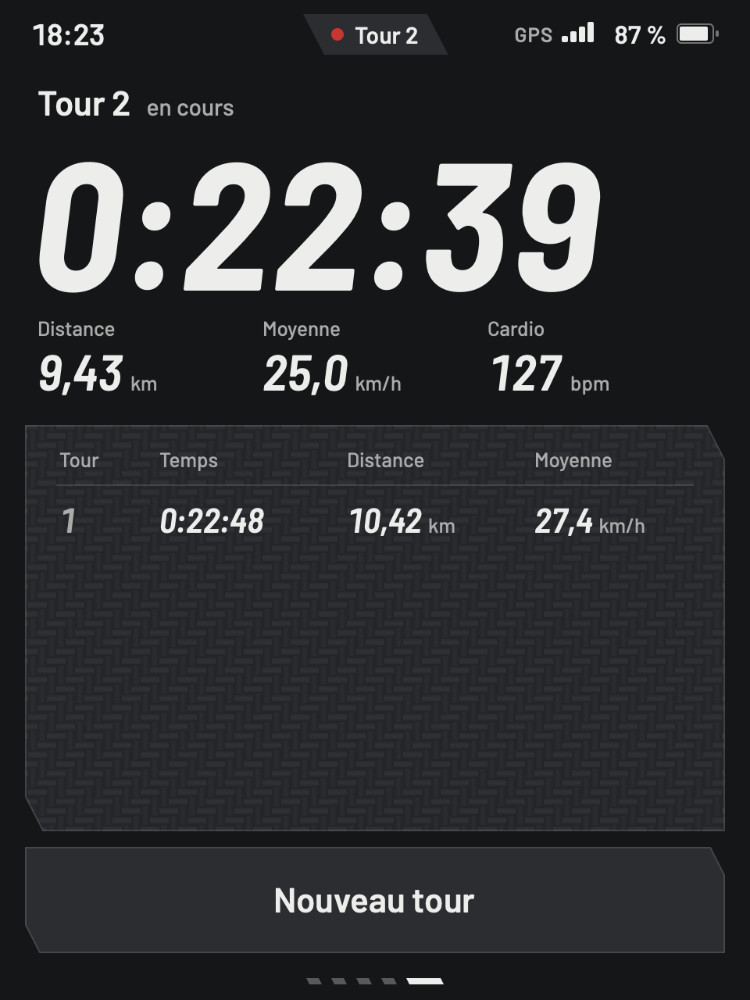
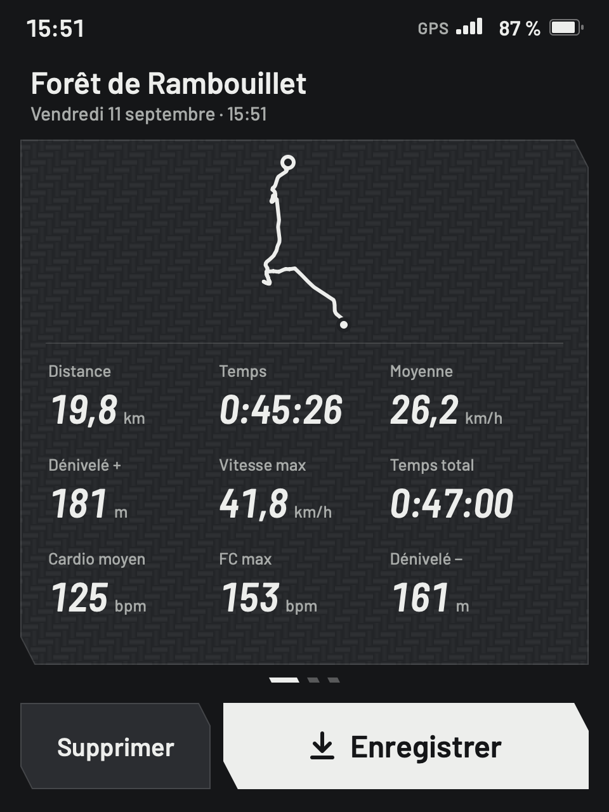
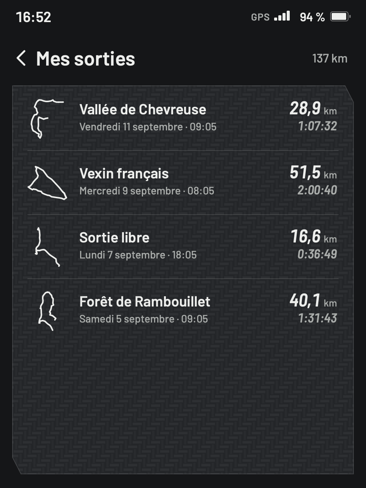

# Canyon compteur

Compteur vélo autonome pour un Canyon Ultimate : Raspberry Pi Zero 2 W, écran tactile 2,8" 480×640 en portrait, interface Qt Quick (PySide6). Projet personnel en cours : sur le Pi, le GPS et la jauge de batterie sont branchés et donnent les vraies mesures ; sur le Mac, tout est simulé (un cycliste qui suit un parcours GPX). Pas encore de ceinture cardio ni de baromètre.

        

## Fonctions

- Parcours GPX (dossier `parcours/`) ou sortie libre ; départ au premier signal GPS.
- Cinq pages pendant la sortie : principale, carte OSM hors ligne, altitude, cardio, tours.
- Auto-pause, tours, résumé de fin de sortie.
- Segments Strava en favori : annonce à l'approche, page en direct comparée à ton record, résultat à l'arrivée (voir [Strava](#strava)).
- Enregistrement en `.fit` (Strava, Garmin Connect) et historique, dans `sorties/`.
- Reprise après coupure : la sortie en cours est écrite dans `sorties/reprise.jsonl` toutes les 30 s.
- Réglages : FC max, auto-pause, luminosité (`~/.config/canyon-compteur/reglages.json`).
- Batterie (depuis les Réglages), en direct pour les essais d'autonomie : charge, autonomie et prévision, tension, variation, courant estimé, alimentation 5 V et température du Pi. Sur le Pi, la jauge MAX17048 (lue toutes les 2 s par son propre fil, `compteur/battery.py`) ; sur le Mac, une batterie simulée. L'autonomie suit la pente de la charge sur les 15 dernières minutes, et le courant se déduit de la capacité (5000 mAh, `CAPACITY_MAH`) : la jauge ne le mesure pas.
- GPS (depuis le menu ≡) : satellites utilisés et en vue, ciel, force du signal, précision, position, altitude et heure UTC. Sur le Pi, le PA1010D lu sur le bus I2C par son propre fil (`compteur/gps/`) ; la vitesse, la position, l'altitude et le cap de la sortie en viennent aussi, et l'accueil n'annonce « Prêt » que quand il capte vraiment. Sur le Mac, un GPS simulé suit le cycliste simulé.

## Lancer sur le Mac

```bash
uv venv .venv && uv pip install --python .venv/bin/python -r requirements-dev.txt
.venv/bin/python -m compteur                                  # fenêtre 480×640
.venv/bin/python -m compteur --sans-intro --accel 10          # sans l'intro, simulation 10× plus rapide
.venv/bin/python -m compteur --screenshot f.png --page carte  # capture sans fenêtre (autres options : --help)
.venv/bin/python -m compteur --mesure                         # fluidité et charge page par page (≈ 3 min)
.venv/bin/python -m compteur --miroir                         # l'écran aussi dans un navigateur (port 8080)
.venv/bin/python -m pytest
```

Clavier : Espace Start/Pause · Entrée valider · ← → pages et parcours · ↑ ↓ listes · L tour · E terminer (en pause) · M menu · R réglages · Retour arrière supprimer · Échap retour · Q quitter (depuis l'accueil).

## Carte hors ligne

Tuiles images dessinées une fois sur le Mac depuis OpenStreetMap (fond Protomaps), puis lues par le compteur dans `cartes/ile-de-france.mbtiles` (non versionné). Sans ce fichier, la page carte montre le parcours sur fond uni.

```bash
brew install pmtiles
pmtiles extract https://build.protomaps.com/20260911.pmtiles cartes/osm-ile-de-france.pmtiles \
  --bbox=1.4462,48.1201,3.5591,49.2415 --maxzoom=15     # ≈ 300 Mo ; builds : https://maps.protomaps.com/builds/
cd tools/carte && npx -y -p node@24 -c "npm install" && npm run construire
```

Zooms 8 à 12 sur toute la région, 13 à 16 autour des parcours (≈ 1 min, ≈ 130 Mo) : à relancer après l'ajout d'un GPX.

## Strava

Les segments vélo mis en favori sur Strava. Annonce à 300 m du départ, page en direct pendant l'effort (écart à ton record au même point, KOM ou QOM), résultat à l'arrivée. Le compteur les synchronise à son démarrage et depuis Menu ≡ → Segments Strava, et les garde pour rouler sans réseau (`~/.config/canyon-compteur/segments.json`).

L'écart au record se compte au même point du segment : les temps de passage viennent de la sortie du record, relue par le compteur. Un record battu avec le compteur sert dès la sortie suivante (`records.json`, à côté), jusqu'à ce que Strava en donne un autre : une fois la sortie envoyée, c'est le temps de Strava qui fait foi. Au simulateur, le parcours « Longchamp et Meudon » passe par deux segments en favori : la boucle de Longchamp et la côte des Gardes.

1. Crée une application sur [strava.com/settings/api](https://www.strava.com/settings/api), avec `localhost` comme Authorization Callback Domain.
2. Relie chaque appareil : le script demande le Client ID et le Client Secret la première fois, puis ouvre la page d'autorisation de Strava.

```bash
.venv/bin/python tools/strava/connecter.py        # ce Mac, puis une première synchro
.venv/bin/python tools/strava/connecter.py --pi   # le Pi (jetons posés par ssh)
```

Un jeton par appareil : Strava peut remplacer un jeton quand il s'en sert, et un jeton partagé couperait l'autre appareil. Strava limite les lectures (100 par quart d'heure) : la synchro ne relit que les segments nouveaux, le KOM une fois par semaine, et la sortie d'un record une seule fois.

## Raspberry Pi

Raspberry Pi OS Lite 64 bits, PySide6 ≥ 6.10 installé par pip.

```bash
tools/pi/envoyer.sh                                               # copie le projet dans ~/compteur
ssh -4 julesvide@compteur.local compteur/tools/pi/installer.sh    # paquets, venv, réserve CMA, droit d'éteindre
ssh -4 julesvide@compteur.local 'cd compteur && .venv/bin/python -m compteur --miroir'
ssh -4 julesvide@compteur.local 'cd compteur && .venv/bin/python tools/pi/essai_capteurs.py'  # jauge et GPS (bus I2C)
sudo systemctl edit compteur     # sur le Pi : --miroir pendant la mise au point (COMPTEUR_OPTIONS)
```

- Plein écran sans bureau (`linuxfb` par DRM), **dessiné par le processeur** (`PI_QT_ENV` dans `compteur/pi.py`). Le GPU est écarté : sur le Zero 2 W, son pilote (vc4) corrompt la mémoire, jusqu'à figer le Pi (noyaux 6.18.34 à 6.18.50).
- L'appli démarre seule (`compteur.service`, posé par `installer.sh`) : elle n'attend pas le réseau, qui coûte 13 s et ne lui sert pas pour s'afficher. Allumage → écran : ≈ 29 s, dont 19 s de système. « Éteindre » arrête le système proprement, et SIGTERM laisse l'appli finir d'écrire la sortie en cours.
- Charge mesurée (`--mesure`, carte complète de 1,5 Go) : carte ≈ 21 images/s pour ≈ 34 % d'un cœur ; intro 63 % ; autres pages ≤ 15 %, CarPlay 11 %. Hors de l'écran, la page CarPlay ajoute ≈ 4 ms à la mise à jour de chaque seconde (0,4 % d'un cœur), mesuré avec et sans elle le 27/09/2026. La mesure prend toujours le cycliste simulé, même sur le Pi : le vrai GPS y est immobile.

Matériel prévu : [docs/materiel.md](docs/materiel.md).

## Organisation

| Dossier | Contenu |
|---|---|
| `compteur/` | backend Python : moteur de calcul sans Qt (`ride.py`), parcours, FIT, historique, reprise, simulateur ; en paquets : `model/` (modèles pour l'interface), `gps/`, `strava/`, `segments/`, `iphone/` ; l'appli (`app.py`), avec le déroulé d'une sortie (`ride_flow.py`), les captures (`captures.py`) et ce qui est propre au Pi (`pi.py`) |
| `compteur/ui/` | interface QML (`Main.qml` : les écrans ; `Shortcuts.qml` : le clavier ; `RideScreen.qml`, `MenuScreens.qml`), une page et ses encadrés par fichier (`GpsPage.qml`, `GpsSky.qml`…), polices Barlow, trame carbone |
| `tests/` | pytest, dont l'appli entière hors écran (`tests/pilote.py`, essais `test_app_*.py`) ; aides partagées dans `strava_fake.py`, `nmea_samples.py` et `conftest.py` |
| `tools/` | fabrication de la carte (Node + MapLibre), connexion à Strava, envoi et installation sur le Pi, trame carbone |
| `parcours/` | parcours GPX de démo |
| `cartes/`, `sorties/` | carte générée et sorties enregistrées (non versionnées) |

## Règles de calcul

- Temps en mouvement, hors pauses. Auto-pause sous 3 km/h pendant 2 s.
- Moyennes pondérées par le temps.
- Dénivelé : variations de plus de 2 m seulement. Pente sur les 40 derniers mètres.
- Zones cardio en % de la FC max (190 par défaut, de 120 à 220) : < 60, 60-70, 70-80, 80-90, > 90 %.
- Hors parcours au-delà de 40 m.

## Reste à faire

- Heure prise au GPS : le Pi n'a pas d'horloge sans réseau. Ceinture cardio BLE et baromètre.
- Écran DPI tactile, boutons, Wi-Fi coupé pendant la sortie.
- Retour guidé vers le parcours ; envoi automatique des sorties.
- Boîtier, montage et essais sur le vélo.

## Crédits

- Logo Canyon redessiné d'après [CanyonBicycles.svg](https://commons.wikimedia.org/wiki/File:CanyonBicycles.svg) (Wikimedia Commons) ; marque de Canyon Bicycles GmbH, usage personnel.
- Logo Strava redessiné d'après [Simple Icons](https://simpleicons.org) (CC0) ; marque de Strava, Inc., usage personnel.
- Police [Barlow](https://github.com/jpt/barlow), licence SIL Open Font License.
- Parcours de démo calculés avec [BRouter](https://brouter.de).
- Données cartographiques © les contributeurs d'OpenStreetMap.
